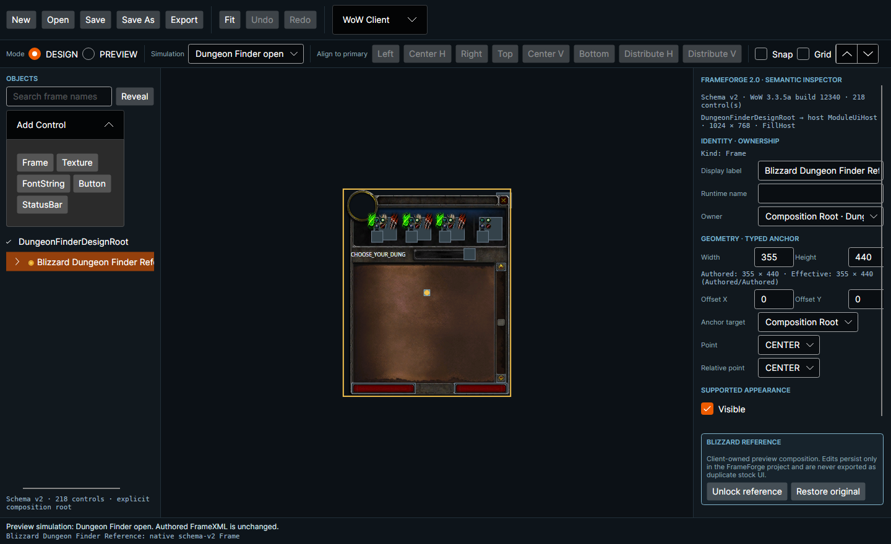
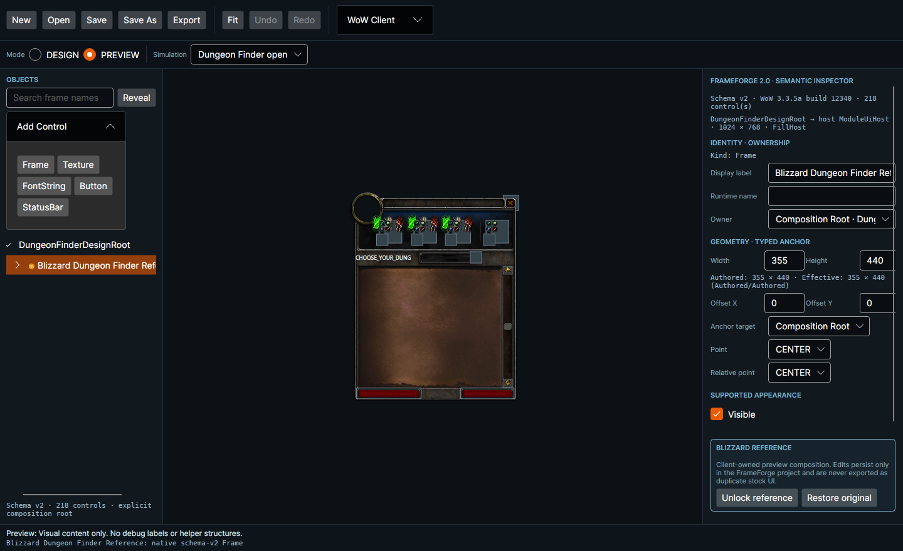
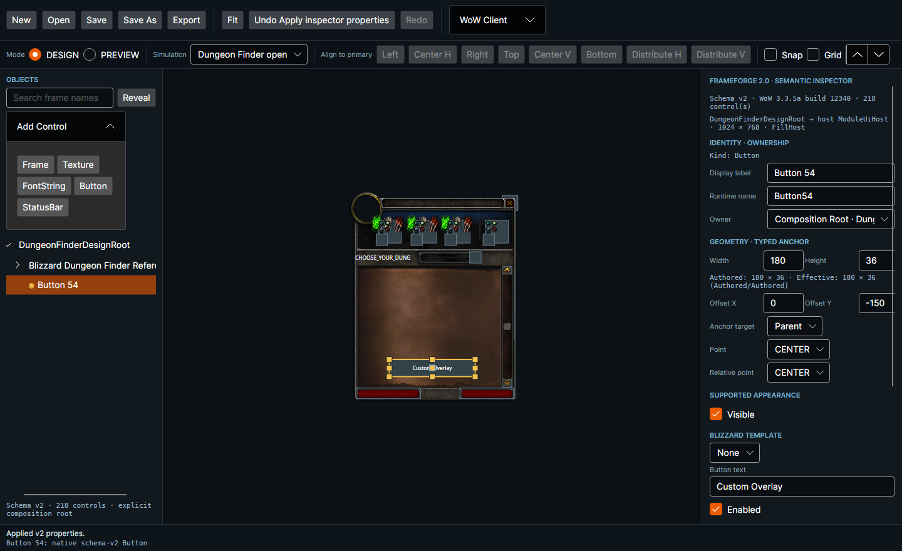

# FrameForge V2 Dungeon Finder Rendering Fix

**Status:** Visual acceptance passed with the configured WoW 3.3.5a build-12340 client  
**Date:** 2026-10-10  
**Branch:** `feature/frameforge-v2`  
**Audited base revision:** `a8f4e392b8297bbd67ef4cdbc375a1c151847def`

## Outcome

The V2 Dungeon Finder starter now renders recognizable Blizzard Dungeon Finder artwork in the real FrameForge application. Design and Preview use the same `UiDocument → UiLayoutResolver → ResolvedUiLayout → LayoutCanvas → VisualContentLayer` path. A custom V2 control can be placed over the locked reference, while export continues to omit every reference-only Blizzard node.

No V1 `Project`, V1 layout snapshot, bundled artwork, downloaded asset, fabricated fallback rectangle, exporter rewrite, commit, or push was introduced.

## Actual client sources

The application read these definitions from `/home/smithkt/WoW-335a` through the existing read-only MPQ provider and managed cache:

| Source | SHA-256 |
|---|---|
| `Interface\FrameXML\LFDFrame.xml` | `cbb539a5a58b522b2b7bdacaf70ddbdfdf3332ad4b8c590d226460b70e209ee4` |
| `Interface\FrameXML\LFGFrame.xml` | `24177edeb88d7ab879a402711076dd87c91bc69b319dc760a8b89aec0bd63cbb` |
| `Interface\FrameXML\UIPanelTemplates.xml` | `08aabf325cdb0c1ef82d029e2bff7793d8d28b80ae3250dd35c817adbd751b00` |
| `Interface\FrameXML\UIDropDownMenuTemplates.xml` | `19b6bd99567a6b7add1fcc60429268ac768f161c0dd6c5d7d4fbc1f5ef9782ee` |
| `Interface\FrameXML\MoneyFrame.xml` | `ff6020de8579576a076610386ec1c501139a7bcacc7702a3c79a4a4187a6cae3` |
| `Interface\FrameXML\ItemButtonTemplate.xml` | `f25de196b0f9386cd33b01470f051c954ffca72464a51b38548a192e4c7f27d8` |

No client file was modified.

## Root causes

Five independent defects contributed to the empty or incomplete result:

1. `LFDParentFrame` is correctly authored as `hidden="true"`; Blizzard Lua shows it when the player opens Dungeon Finder. V1 explicitly force-showed that root for design. V2 preserved the authored flag but initially selected **XML Defaults**, so every descendant was effectively hidden even when its texture decoded.
2. The narrow V2 reader retained `inherits` only as provenance. It did not instantiate the static children, regions, normal-state textures, sizes, anchors, texture coordinates, color/alpha, or visibility supplied by Blizzard templates in other FrameXML files.
3. V2 anchor parsing read attributes on `<Offset>` but not the normal build-12340 form `<Offset><AbsDimension x="…" y="…"/></Offset>`. Targets were correct while offsets were silently zero.
4. Multi-anchor reference regions retained a template seed size even when opposing native anchors established their actual extent. This left three-slice button middles at 12 pixels instead of stretching between left and right slices.
5. V2 region properties had no visibility value, so a template texture authored `hidden="true"` could not retain its static visibility independently of its owner.

Asset lookup, BLP/TGA decoding, the V2 canvas transform, canvas clipping, and the primary paint pipeline were not the causes. The quest-paper asset decoded before this correction; it was filtered out by effective visibility.

## Original V1 behavior and reused components

The V1 command materialized `LFDFrame.xml`, imported the subtree, changed `LFDParentFrame.Visible` to `true`, and then used the existing client asset/cache and canvas services. Its general importer already understood nested `Offset/AbsDimension`. The V1 stock resolver could also apply selected template and font geometry to a V1 presentation project.

The correction reuses the MPQ readers, validated-client service, managed cache/provenance, texture resolver, BLP/TGA decoders, V2 layout math, existing canvas, and existing exporter. It adapts only the required static FrameXML semantics into the V2 starter. It does not restore V1 live-model or projection dependencies.

## V2-native template expansion

`V2DungeonFinderStarter` now accepts the exact client-owned template source snapshots listed above and indexes their virtual definitions. For a Dungeon Finder instance it recursively applies the static inheritance chain, then ingests:

- inherited frame/button/scroll children;
- inherited `Texture` and `FontString` regions;
- template dimensions and native anchors;
- normal-state and thumb textures used in a static preview;
- texture paths and `TexCoords`;
- layer identity, color, alpha, and hidden state;
- `$parent` names and sibling references.

The expansion is transient and reference-only. The persistent document remains `UiDocument`. Lua and scripts are never executed. Required source files must materialize successfully; missing definitions produce a project-creation diagnostic rather than substitute artwork.

The resulting reference contains the close button, role button regions, dropdown chrome, random/specific scrollbars, loot/money structure, three-slice panel buttons, and the direct LFD frame art.

## Visibility, anchors, geometry, and paint order

The starter preserves `LFDParentFrame` as authored hidden and supplies a **Dungeon Finder open** editor-only simulation that changes the root visibility transiently. The application selects that state after project creation. Serialization and export retain the original authored value.

Nested absolute offsets now retain their source values. For example, the quest-paper anchor is `LEFT + (21, -64)` exactly as declared. Local sibling references such as healer relative to tank resolve to semantic IDs. External globals remain external rather than being substituted with `UIParent`.

For reference-only nodes, opposing anchors determine the corresponding dimension. Authored overlay controls keep the existing rule and behavior. This makes template three-slice middles and anchor-filled regions match their native constraints without weakening authored-control validation.

Paint order still comes from the existing resolver. Native region layer is retained, so `UI-LFG-FRAME` in `BACKGROUND` paints before `UI-LFG-BACKGROUND-QUESTPAPER` in `BORDER`. Hidden alternate panels and regions stay out of the default composition.

## Before and after measurements

The confirmed failing build-12340 baseline had 72 reference members plus the composition root, with only 20 of 73 layout elements resolved. It imported 10 direct textures, but the authored hidden root made zero textures effectively visible in the normal clean view. Diagnostics were 41 anchor-target, 46 height, and 32 width errors; these overlap by node.

A controlled direct-only run after the offset/visibility corrections, but without template expansion, resolves 21 of 73 elements, 8 textures, and 5 visible textures. This isolates the inheritance gap from the visibility defect.

The final client-backed result is:

| Measurement | Final result |
|---|---:|
| Reference members | 218 |
| Layout elements including composition root | 219 |
| Resolved elements | 175 |
| Unresolved elements | 44 |
| Imported textures | 78 |
| Resolved textures | 67 |
| Visible textures in **Dungeon Finder open** | 25 |
| Imported FontStrings | 55 |
| `FFV2L-ANCHOR-TARGET` | 22 |
| `FFV2L-HEIGHT` | 22 |
| `FFV2L-WIDTH` | 9 |
| Semantic validation errors | 0 |

Adding the authored overlay produces 176 resolved elements while the 44 unresolved reference elements remain explicit.

## Remaining diagnostics and visual differences

The remaining 44 unresolved elements are not needed to form the visible static frame. They are primarily:

- automatic/localized FontStrings whose width or height depends on actual localized string values and font measurement;
- descendants anchored to those unresolved automatic text regions;
- loot and money values populated or resized by runtime Lua;
- hidden cooldown, party-backfill, and LFR-conflict panels whose content is runtime state;
- dependency cascades from the above.

All remaining anchor-target diagnostics name local nodes whose geometry is unresolved; there are no silently redirected external globals.

The role textures are atlas textures whose per-role `TexCoords` and background alpha are selected by `OnLoad` Lua (`GetTexCoordsForRole` and `GetBackgroundTexCoordsForRole`). FrameForge does not execute that Lua and does not invent crops, so the screenshots show the source atlas rather than the final tank/healer/damage crop. Localized string constants are displayed as retained source tokens where geometry is available. These are known static-preview differences, not asset failures.

## Real application visual evidence

The Release application ran on the active X11 session (`DISPLAY=:0`) against the configured `/home/smithkt/WoW-335a` client. Its focused smoke opened a new Dungeon Finder project, used the production `MainWindow`, view model, layout canvas, texture resolver, and renderer, and reported 25 texture submissions in both Design and Preview.

### Design

### Preview

### Design with authored overlay

The focused real-window smoke passed every check. Design shows the locked reference and selection geometry; Preview removes editing decoration while retaining the same 25-texture composition; the overlay capture shows a selected, independently authored `Custom Overlay` button.

## Export compatibility

The V2 exporter was not rewritten. Reference-only Blizzard controls, template-expanded regions, reference edits, and preview simulations are removed before normal export validation. An authored overlay exports normally. The real-source regression asserts that neither `LFDParentFrame` nor `UI-LFG-BACKGROUND-QUESTPAPER` appears in exported XML. All 15 exporter tests pass and golden fixtures are unchanged.

## Automated verification

Executed in Release configuration on 2026-10-10:

| Verification | Result |
|---|---:|
| Release build | PASS — 0 warnings, 0 errors |
| Complete suite | PASS — 725 passed (480 Core + 245 Desktop) |
| Focused V2 | PASS — 136 passed (109 Core + 27 Desktop) |
| Blizzard/template integration | PASS — 10 passed |
| Real hashed build-12340 Dungeon Finder test | PASS — 1 |
| Native Avalonia rendering focus | PASS — 5 |
| V1 `FrameXmlImportTests` compatibility | PASS — 80 |
| Existing V2 exporter | PASS — 15 |
| Real X11 application visual smoke | PASS |

The real-source test verifies inheritance, inherited regions and dimensions, parent/sibling anchors, opposing-anchor geometry, texture coordinates, visibility, paint ordering, actual canvas texture submissions, reference locking, authored overlay independence, and export exclusion. The complete suite retains V1 compatibility coverage.

## Files changed for this correction

- `src/FrameForge.Core/Semantics/V2/UiDocument.cs`
- `src/FrameForge.Core/Semantics/V2/ResolvedUiLayout.cs`
- `src/FrameForge.Desktop/Services/V2DungeonFinderStarter.cs`
- `src/FrameForge.Desktop/Services/SmokeTest.cs`
- `src/FrameForge.Desktop/ViewModels/MainWindowViewModel.V2.cs`
- `tests/FrameForge.Desktop.Tests/V2BlizzardReferenceTests.cs`
- `docs/FRAMEFORGE_DUNGEON_FINDER_RENDERING_FIX.md`
- `docs/FRAMEFORGE_PHASE3_5_IMPLEMENTATION.md`
- `docs/FRAMEFORGE_ROADMAP.md`
- `docs/evidence/dungeon-finder-rendering/*.png`

## Acceptance status

The requested visual acceptance is **complete for the supported static reference scope**. Recognizable real-client artwork appears in Design and Preview, inherited Blizzard textures render, an authored overlay can be edited above the protected reference, exporter isolation remains intact, the full suite is green, and actual-application screenshots are recorded.

This is not a claim that FrameForge executes Blizzard gameplay Lua or matches every runtime-populated pixel. The remaining runtime-only and automatic-text boundaries above stay diagnosed and visible.
